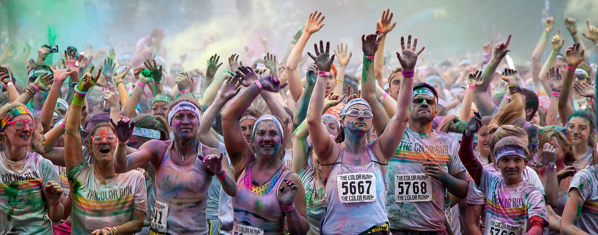
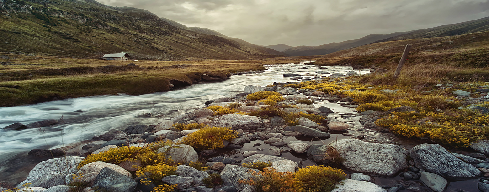
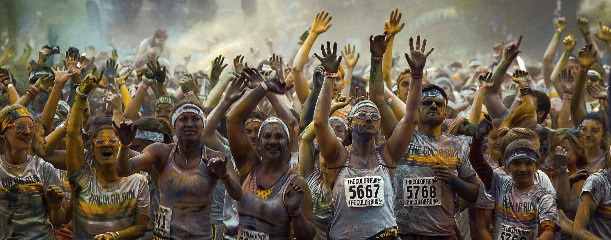

# Optimal-Transform
The goal of this school assignment is to apply optical transform from an image into the other one.
in this exemple we'll apply the nature image on the marathon image to make it look better.

original Marathon image:

original Nature image:

Final image:

